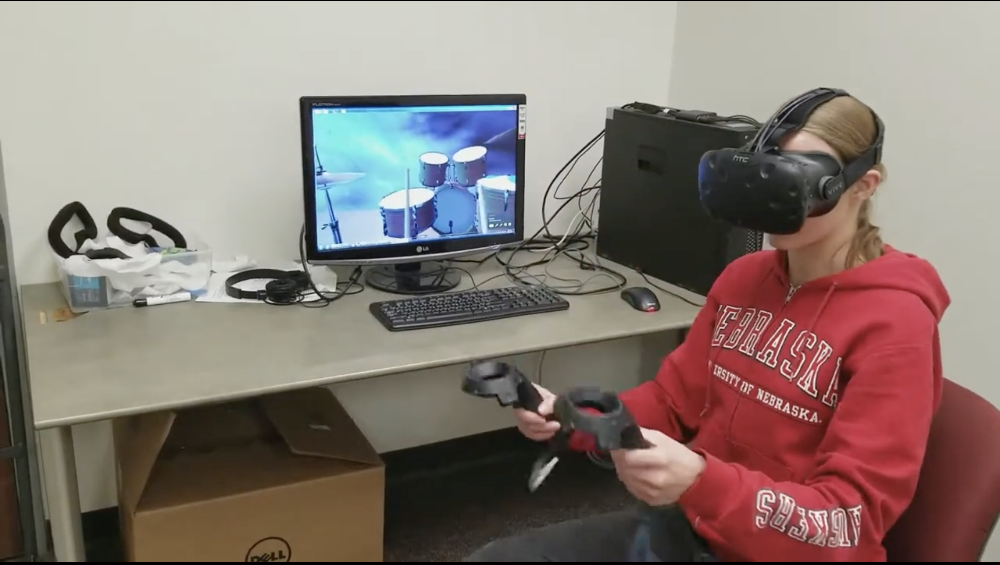

# Team RAD - Final Project

This project explores the innovative integration of digital technology with traditional musical instruments, specifically focusing on a drum kit. The core of the project is a drum kit wired with servo motors, each equipped with a drumstick capable of actuating to strike the drums. This setup is connected to the internet, allowing remote control through various digital interfaces: a virtual reality Unity game, a website, and an API. A key feature of the project is the ability to play the drum kit in real life via a virtual reality headset, demonstrating a seamless blend of virtual and physical interactions. The project was showcased, highlighting the effective remote operation of the drum kit and its potential in revolutionizing musical performances. This venture not only exemplifies technological innovation but also opens new avenues in the realm of interactive and remote-controlled musical instruments.

## Authors

* **Carl Hildebrandt** - *Initial work* - [hildebrandt-carl](https://github.com/hildebrandt-carl)
* **Rebecca Horzewski** - *Initial work* - [rhorzewski](https://github.com/rhorzewski)
* **Eric Tran** - *Initial work* - [SilverShadowx](https://github.com/SilverShadowx)

